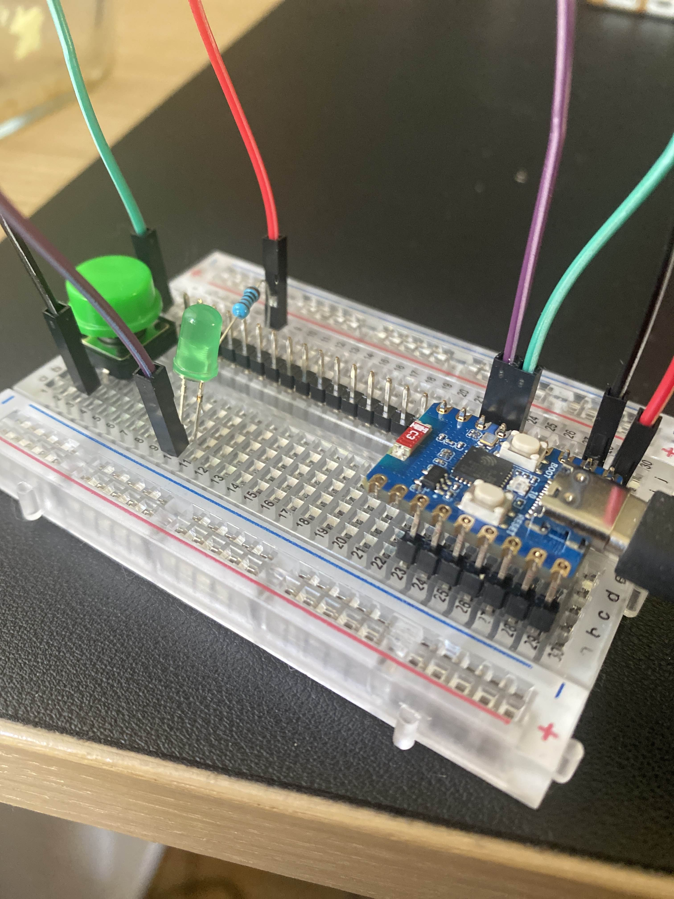

#  # NeverAlone IoT – Developer Setup Guide

## 1. Clone the Repository

git clone https://github.com/ChasChallangeIII/NeverAlone

cd IoT

## 2. Install PlatformIO

### Visual Studio Code (Recommended)

1. Install [Visual Studio Code](https://code.visualstudio.com/)
2. Open VS Code and go to the **Extensions** panel.
3. Search for and install **PlatformIO IDE**.
4. Restart VS Code once the installation is complete and open the project with the IoT-folder as root.

## Wiring Instructions

To assemble the **NeverAlone IoT Button**, connect the components as follows:

---

## Required Components

| Component       | ESP32 GPIO Pin | Details                                                                 |
|----------------|----------------|-------------------------------------------------------------------------|
| Push Button     | GPIO 2         | Connect one leg to GPIO 2, the other to GND. Use a 10kΩ pull-down resistor if needed. |
| Power Supply    | 3.3V / VIN     | Use USB or LiPo battery depending on your board.                       |
| Common Ground   | GND            | Ensure all components share the same ground as the ESP32.              |
| LED             | GPIO 3         | Connect to GPIO 3. Make sure to use a resistor                         |        
---

 
> **Note:** Always check your specific ESP32 dev board pinout before connecting components.

## 3. Build & Upload Firmware
Connect your ESP32 device via USB, then press the upload button in the bottom toolbar to Upload to the ESP32. 
For further information of how to use platformIO [click here](https://docs.platformio.org/en/latest/core/quickstart.html)

### Monitor Serial Output (Optional)
To debug or view logs press the Serial monitor button in the toolbar
