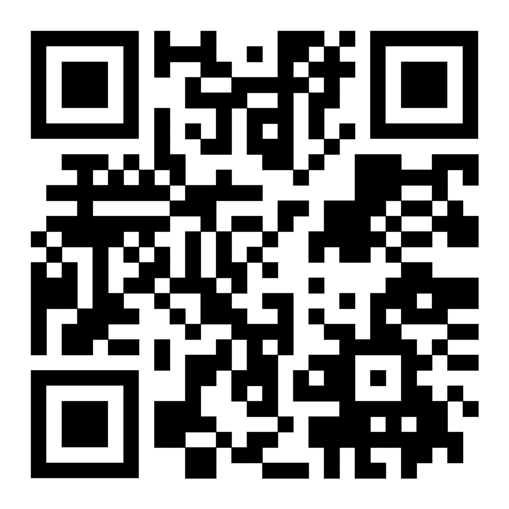

# **Never Alone** – Chas Challenge 2025

## **Project Overview**
Never Alone is a smart safety solution designed to help individuals feel more secure in public spaces. By pressing a discreet IoT button, users trigger an incoming call simulation, making them appear occupied. They can later fill out a survey in the mobile app to describe why they felt unsafe. Anonymized data can be shared with municipalities to improve urban safety measures.

## **Features**
- **One-Tap Safety** – Press the button to receive a simulated call and appear busy.
- **Survey Submission** – Users will fill in surveys at a later time explaining why they pressed the button.
- **Data Insights** – The survey reports help municipalities identify unsafe areas.
- **Cross-Platform App** – Available on mobile devices with a clean and intuitive UI.
- **IoT-Enabled Button** – Physical hardware integration for seamless interaction.
- **Real-Time Data Sharing** – Municipalities and organizations can access statistical reports on unsafe areas.
- **Customizable Notifications** – Users can set up emergency contacts for additional security.

## **Tech Stack**
### **Frontend (Mobile App)**
- React Native
- Javascript
- Context API for state management
- Figma

### **Backend (API & Database)**
- Node.js with Express
- PostgreSQL
- RESTful API for communication
- WebSockets for real-time updates

### **IoT System (Button & Sensors)**
- Arduino / ESP32
- C++ for embedded programming
- Low-power Bluetooth connectivity

---

## **Download APK**

Scan the QR code below or [click here to download the APK](https://drive.google.com/file/d/1-6ZUxQ8wZTmUFPNDRTfz4qZsRKQyMKzK/view?usp=drive_link):

##  **Other Project Modules**

- [Admin Panel](https://github.com/ChasChallangeIII/NeverAlone/blob/main/adminpanel/README.md)
- [Mobile App](./never-alone-app/README.md)
- [IoT Button](https://github.com/ChasChallangeIII/NeverAlone/blob/main/IoT/README.md)
- [Server](https://github.com/ChasChallangeIII/NeverAlone/blob/main/server/README.md)
